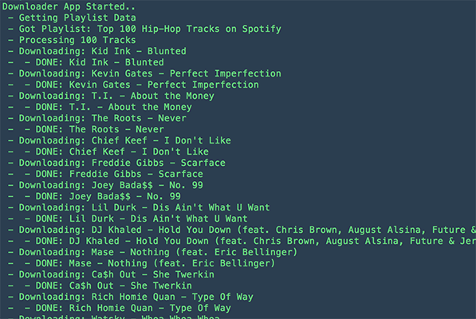

# Spotify Playlist Downloader

Download an entire spotify playlist ( FROM SPOTIFY @ 160kbps ) to your local machine.

Also upon download it writes the ID3 data to the file.

###To install:
Install nodejs if you haven't already. ( [NodeJS Downloads](http://nodejs.org/download/) )

	npm install -g spotify-playlist-downloader

###Available Options

	
	Usage: spotify-playlist-downloader [options]
	
	Options:

	    -h, --help                   output usage information
	    -V, --version                output the version number
	    -u, --username [username]    Spotify Username (required)
	    -p, --password [password]    Spotify Password (required)
	    -l, --playlist [playlist]    Spotify URI for playlist
	    -d, --directory [directory]  Directory you want to save the mp3s to
	

####So if you wanted to download "Top 100 Hip-Hop Tracks on Spotify". You would use the following command:

	spotify-playlist-downloader -u yourusername -p yourpassword -l 	spotify:user:spotify:playlist:06KmJWiQhL0XiV6QQAHsmw -d /directory/where/to/download

####The output should look something like:

###Must haves:

- Spotify Premium Account ( haven't tried it on a free account )
- Only tested on Mac OSX 10.10 ( Should work on Linux and Windows as well??? )

### Disclaimer:

- This was done purely as an academic exercise.
- I do not recommend you doing this illegally or against Spotify's terms of service.